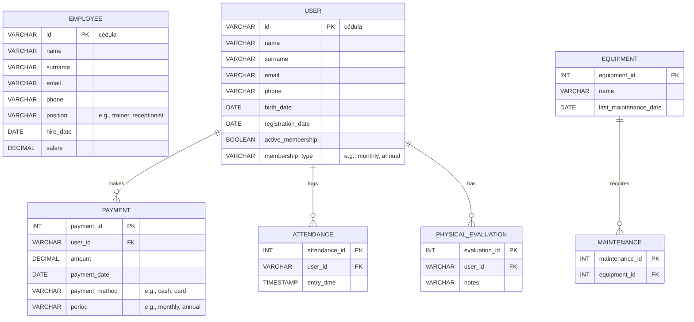

# Database model

```mermaid
erDiagram
    EMPLOYEE {
        VARCHAR id PK "cédula"
        VARCHAR name
        VARCHAR surname
        VARCHAR email
        VARCHAR phone
        VARCHAR position "e.g., trainer, receptionist"
        DATE hire_date
        DECIMAL salary
    }

    USER {
        VARCHAR id PK "cédula"
        VARCHAR name
        VARCHAR surname
        VARCHAR email
        VARCHAR phone
        DATE birth_date
        DATE registration_date
        BOOLEAN active_membership
        VARCHAR membership_type "e.g., monthly, annual"
    }

    PAYMENT {
        INT payment_id PK
        VARCHAR user_id FK
        DECIMAL amount
        DATE payment_date
        VARCHAR payment_method "e.g., cash, card"
        VARCHAR period "e.g., monthly, annual"
    }

    ATTENDANCE {
        INT attendance_id PK
        VARCHAR user_id FK
        TIMESTAMP entry_time
    }

    PHYSICAL_EVALUATION {
        INT evaluation_id PK
        VARCHAR user_id FK
        VARCHAR notes
    }

    EQUIPMENT {
        INT equipment_id PK
        VARCHAR name
        DATE last_maintenance_date
    }

    MAINTENANCE {
        INT maintenance_id PK
        INT equipment_id FK
    }

    USER ||--o{ PAYMENT : "makes"
    USER ||--o{ ATTENDANCE : "logs"
    USER ||--o{ PHYSICAL_EVALUATION : "has"
    EQUIPMENT ||--o{ MAINTENANCE : "requires"
```
